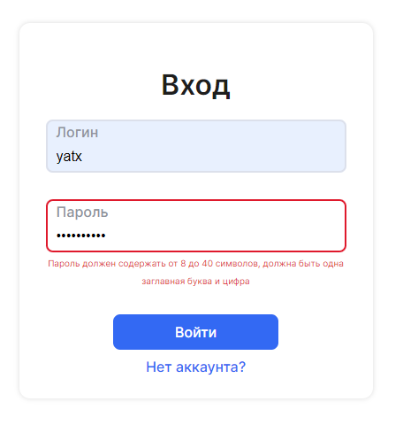
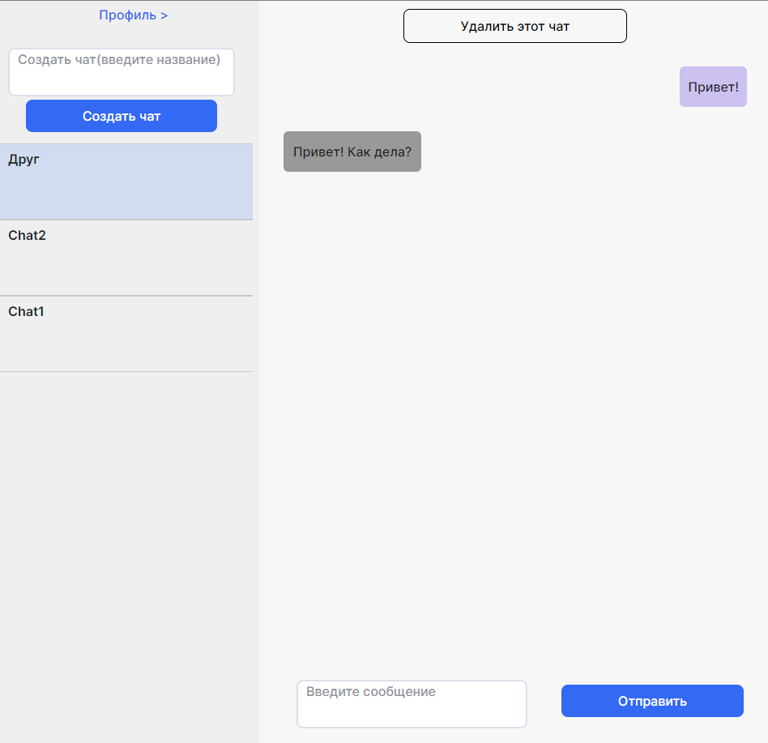

# Webchat

Student project using Pug, Typescript and Webpack

## Демо

[Netlify](https://yatxwebchat.netlify.app/)

## Требования

- NodeJS v12.x+
- NPM v8.x+

## Запуск

1. `git clone https://github.com/andreyatx/middle.messenger.praktikum.yandex.git`
2. `npm i --legacy-peer-deps`

## Комманды

- Запуск локально, в режиме разработки:
  `npm run dev`

- Сделать сборку:
  `npm run build`

- Запуск локально:
  `npm run start`

## Скриншоты

## Design

[Figma](https://www.figma.com/file/jF5fFFzgGOxQeB4CmKWTiE/Chat_external_link?node-id=0%3A1)
